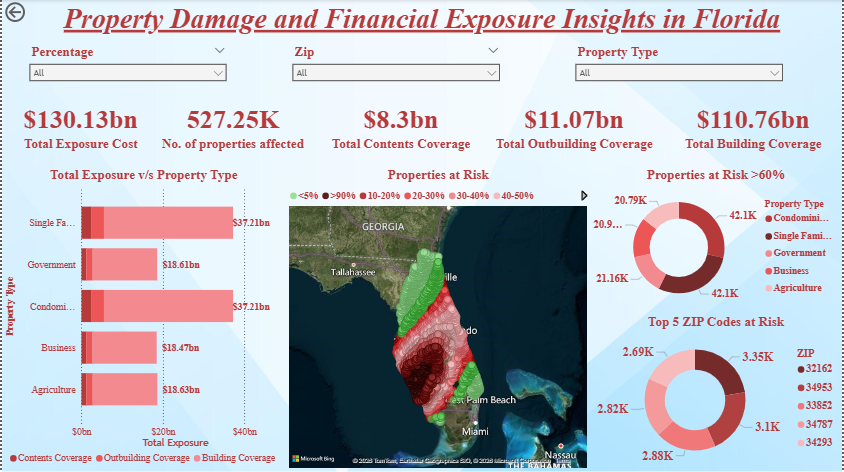

# Hurricane Ian Insurance Risk Analysis

## Overview

This project analyzes the potential financial exposure of KDC Property Insurance due to Hurricane Ian (2022).
Using property location data and NOAA hurricane wind probability shapefiles, we identify insured properties with a **greater than 60% probability of experiencing hurricane-force winds** and estimate the **maximum financial exposure** if these properties were completely destroyed.
The analysis integrates **GIS spatial analysis, insurance exposure calculations, and data visualization using Tableau.**

---
## Objectives

The project answers two key questions:
1. **What is the maximum financial exposure for KDC Insurance if all high-risk properties are destroyed?**

2. **Which five ZIP codes contain the highest concentration of affected properties?**

---

## Data Sources

### Property Dataset
Contains insured properties including:

* Latitude / Longitude
* Market Value
* Sale Price
* Coverage percentages
* Property Type

### Hurricane Data
NOAA Hurricane Ian shapefiles containing wind probability zones.
Source:
https://www.nhc.noaa.gov/gis/archive_wsp.php?year=2022

---

## Methodology

### 1. Data Preparation
* Cleaned property dataset
* Converted latitude and longitude to spatial points
* Imported NOAA shapefiles

### 2. Spatial Analysis
Using GIS tools to identify properties located within hurricane wind probability zones.
Properties with **>60% probability of hurricane-force winds** were selected.

---

### 3. Exposure Calculations
Property value was calculated as:
```
Property Value = MAX(Sale Price, Market Value)
```
Insurance coverage values were calculated as:
```
Building Coverage = Property Value × Coverage_Building %
Contents Coverage = Building Coverage × Coverage_Contents %
Outbuilding Coverage = Building Coverage × Coverage_Outbuildings %
```
Total potential loss:
```
Total Exposure = Building + Contents + Outbuilding Coverage
```
---

### 4. Geographic Risk Analysis
Affected properties were grouped by ZIP code to identify areas with the highest concentration of risk.

---

## Dashboard

The final analysis was visualized in PowerBI, including:
* Geographic risk map
* Exposure distribution
* Top 5 ZIP codes by affected properties
* Coverage breakdown
* Properties at Risk >60%
Example dashboard:


---

## Technologies Used

* Python
* Pandas
* GeoPandas
* Shapely
* Tableau
* GIS Spatial Analysis

---

## Repository Structure

```
data/         -> original datasets & cleaned datasets used for analysis
notebooks/    -> Jupyter analysis notebooks
powerbi/      -> Tableau dashboards and visualization screenshots 
```

---

## Key Insights

* Hurricane Ian created significant concentration risk in several ZIP codes.
* Financial exposure is driven primarily by building coverage.
* Spatial analysis helps insurers identify high-risk clusters and manage catastrophe risk.

---

## Future Improvements

* Incorporate storm surge modeling
* Use probabilistic catastrophe models
* Add time-series hurricane path analysis
* Develop interactive risk forecasting dashboards

---


